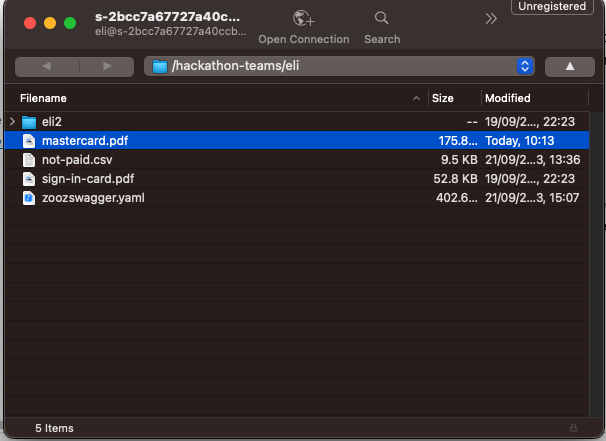

Jarvis supports loading documents from 3 data sources:        
1. **SFTP**  
2. **Confluence**  
3. **Webpages**  

### SFTP
Your team will not only receive a private-key and app-id for the API, but it will also receive a set of credentials to use the SFTP server.  
* Private key  
* Username  
* Password  
* Address  

Once you connect to the sftp, you will have your own folder where you can upload your files.
A recommended SFTP client for mac can be [Cyberduck](https://cyberduck.io/)




in this example we uploaded multiple files to the sftp folder

> **_NOTE:_** At this point in time, those file are not yet known to Jarvis, and not stored in Postgres as vectors.
> They are only stored in the SFTP.

#### Loading the files from SFTP to jarvis

Jarvis is connected to the sftp and is able via API to get a trigger and upload specific file from the SFTP to Postgres.
Prior to this, jarvis will call Amazon titan embedding model and create a vector as we learned in the RAG part. 
To do that:

```json
curl --location 'https://api.paymentsos.com/hackathon-ai/load' \
--header 'private-key: replaceme' \
--header 'app-id: replaceme' \
--header 'Content-Type: application/json' \
--data '{
    "loader": {
        "type": "sftp",
        "files": ["mastercard.docx"]
    },
    "collection": "hackathon"
}'
```

After a successful response, those file that we loaded will exist in Jarvis, and we will be able to ask question about them.
More on that on the next chapter.

> **_collection:_** By choosing different collection in the API you can isolate different docs, you will be able to
> specify the collection on your prompts

### Confluence

Jarvis is also directly integrated to our confluence (https://gpo-engineering.atlassian.net/wiki)  
You can use Jarvis API to stream confluence pages and space in one API call.

in this example we will publish the whole space but limit to 20 pages

```json
curl --location 'https://api.paymentsos.com/hackathon-ai/load' \
--header 'private-key: replaceme' \
--header 'app-id: replaceme' \
--header 'Content-Type: application/json' \
--data '{
    "loader": {
        "type": "confluence",
        "space": "HUB",
        "max_pages": 20
    },
    "collection": "confluence"
}'
```

and in this example we will choose to load only specific page ids from confluence
```json
curl --location 'https://api.paymentsos.com/hackathon-ai/load' \
--header 'private-key: replaceme' \
--header 'app-id: replaceme' \
--header 'Content-Type: application/json' \
--data '{
    "loader": {
        "type": "confluence",
        "space": "HUB",
        "page_ids": ["114327634", "830275595"]
    },
    "collection": "confluence"
}'
```

> **_NOTE:_** Uploading multiple pages from confluence can take some time, and you may get a timeout,
> we suggest starting with limited number of page_ids. At any case, if there is a timeout from the client, Jarvis will
> continue uploading the files.


### Webpages

Uploading a webpage is simple as that:  

```json
curl --location 'https://api.paymentsos.com/hackathon-ai/load' \
--header 'private-key: replaceme' \
--header 'app-id: replamce' \
--header 'Content-Type: application/json' \
--data '{
    "loader": {
        "type": "web",
        "urls": ["https://medium.com/payu-engineering/unlocking-the-power-of-debezium-69ce9170f101", "https://medium.com/payu-engineering/strengthen-the-platforms-security-with-capture-the-flag-aafc4ee12c65"]
    },
    "collection": "website-hackathon"
}'
```

